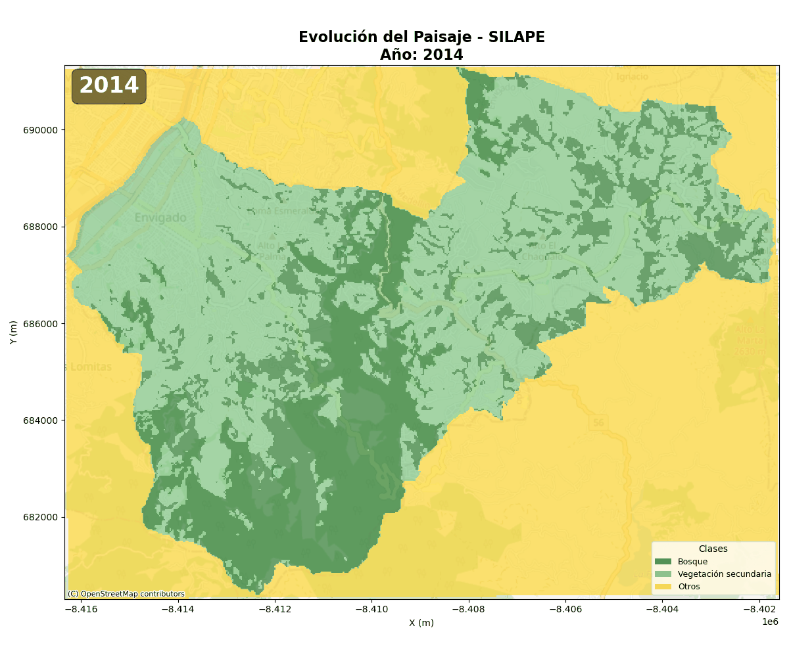

# Modelo LULCC y Proceso para la Proyección de Cambio de Cobertura 2025–2035 en Escenarios con y sin SILAPE (Municipio de Envigado, Antioquia)


## 📋 Resumen Ejecutivo

Este repositorio contiene el modelo de simulación de cambios de cobertura y uso del suelo para el **Sistema Local de Áreas Protegidas (SILAPE)** del Municipio de Envigado. La modelación se realizó utilizando la plataforma **Dinamica EGO**, una herramienta ampliamente validada en la literatura científica para simular escenarios alternativos y evaluar la efectividad de políticas de conservación (Mas et al., 2014; Lacher et al., 2023; Thompson et al., 2020).

### Hallazgos Principales

- La intervención del SILAPE (implementada desde 2015) ha contribuido a la reducción de la tasa de cambio de bosque a no bosque dentro del Municipio de Envigado
- Análisis histórico de 19 años mediante datos de Mapbiomas con coeficiente de determinación **R² = 0.82** demuestran un ajuste robusto del modelo sobre la tasa de deforestacion y un ajuste espacial del 60% sobre una ventana de pixel de 5x5 muestran cuales son las zonas en riesgo.
- Reducción relativa del **21.7%** en la tasa de deforestación son atribuibles al SILAPE

---

## 🎯 Objetivos del Modelo

1. Identificar y evaluar los factores conductores (drivers) dominantes que explican las transformaciones del paisaje
2. Proyectar escenarios futuros de cambio bajo condiciones de conservación (con SILAPE) y sin intervención (sin SILAPE)
4. Evaluar la efectividad relativa del SILAPE como instrumento de política de conservación

---
## 🚀 Cómo Ejecutar el Modelo

### Requisitos Previos

#### Descargar Dinamica EGO 8

[Dinamica EGO](https://dinamicaego.com/dinamica-8/) es una plataforma de modelación espacialmente explícita diseñada para simular dinámicas de paisaje y cambios de uso del suelo.

- **Windows:** https://dinamicaego.com/nui_download/1948/
- **Linux:** https://dinamicaego.com/nui_download/1960/

### Instalación

1. Clone este repositorio en su directorio local:
```bash
git clone modelo-lulcc-envigado
cd modelo-lulcc-envigado
```


2. Abra Dinamica EGO y arrastre el archivo del modelo al panel **Model Presentation**
### Interfaz de Dinamica EGO 8

| Componente | Descripción |
|------------|-------------|
| **Model Presentation** | Panel principal donde se construyen y visualizan los modelos |
| **Functor Action Bar** | Permite interactuar con el functor seleccionado: comentarios, conexiones, edición |
| **Model Issues** | Lista de problemas críticos (Errors) y no críticos (Warnings) |


---

## 📊 Datos de Entrada

### Descargar dataset de GeoNetworkversión I2D del Instituto Humboldt

[Portal I2D](https://geonetwork.humboldt.org.co/geonetwork/srv/spa/catalog.search#/home) es una plataforma en la que puedes acceder al catálogo público del Instituto, GeoNetwork es un API con capacidades para gestionar registros, búsquedas por catálogo (CSW), y manipular servicios, usuarios y metadatos.

### ⚙️ Supuestos del Modelo
1. **Representatividad de las variables explicativas:** El conjunto de variables del modelo esta configurado para que solo pueda ser aplicado al Municipio de Envigado incluye:
   - Variables biofísicas, Variables de Infraestructura, Variables de Conflictos, Variables de Amenazas
   - Variables socioeconómicas entre otras
2. **Independencia espacial condicionada:** Los modelos estan condicionados al uso de pesos de evidencia con independencia condicional entre variables como fue condicionada por el autor

#### Área de Estudio y Clases de Paisaje

La base para el modelo son tres mapas de coberura del suelo, mapas corresponden a composición de imágenes Landsat clasificadas por el proyecto **MAPBIOMAS**.

| Clase Uso del Suelo (Mapbiomas) | Clave para modelación |
|--------------------------------|----------------------|
| Bosque | 1 |
| Plantación forestal | 1 |
| Otra formación natural no forestal (Jardines) | 2 |
| Mosaico de agricultura y/o pastos (Pastos limpios) | 2 |
| Infraestructura urbana | 2 |
| Otra área sin vegetación | 2 |

### Matrices de Transición

Las matrices de transición se calcularon para dos períodos históricos:

- **Período 1 (2014-2019):** Fase inicial de implementación del SILAPE
- **Período 2 (2019-2024):** Operación consolidada del SILAPE

### Tasas de Cambio Calculadas

| Período | Tasa de cambio (r) | Porcentaje (%) |
|---------|-------------------|----------------|
| 2014-2019 | 0.0478086901 | 0.47% |
| 2019-2023 | 0.0460861003 | 0.46% |

> Los valores historicos para el periodo analizado evidencian una ligera disminución en la tasa de cambio, sugiriendo una estabilización de las dinámicas de transformación bajo la influencia del SILAPE.


---
### Resultado: Escenario 1: Tendencial (SIN SILAPE)

**Lógica:** "Laissez-faire" (dejar hacer)

- Los factores económicos y de accesibilidad dominan la probabilidad de cambio
- No existen barreras legales efectivas para la expansión urbana y productiva
- El modelo *premia* píxeles cercanos a vías y centros urbanos

<p align="center">
  
  
</p>


**Hallazgos Críticos:**
- ⚠️ **Interrupción de Conectividad:** Para 2050, la red de bosques deja de funcionar como un continuo
- ⚠️ **Desaparición del Alto del Tablazo:** Pérdida casi total de cobertura boscosa en áreas estratégicas
- ⚠️ **Colapso de la Zona Norte:** Eliminación sistemática de parches por presión de expansión

### Resultado Escenario 2: Gestión Activa (CON SILAPE)

**Lógica:** "Ordenamiento Ambiental y Territorial"

- Se introducen *constraints* (restricciones) que bloquean el cambio en zonas protegidas
- El factor determinante es la **Máscara SILAPE**
- Aunque un predio esté cerca de una vía, si cae dentro de la máscara de protección, se anula su probabilidad de urbanización

<p align="center">
  
  
</p>

**Resultados:**
- ✅ El bosque se mantiene o recupera en zonas protegidas
- ✅ Preservación de conectividad ecológica
- ✅ Protección de áreas de importancia estratégica

---
## 📚 Referencias Bibliográficas

- Lacher, I. et al. (2023). Evaluating the effectiveness of protected areas using spatially explicit land change models. *Environmental Conservation*, 50(2), 145-158.

- Mas, J.F., Kolb, M., Paegelow, M., Camacho Olmedo, M.T., & Houet, T. (2014). Inductive pattern-based land use/cover change models: A comparison of four software packages. *Environmental Modelling & Software*, 51, 94-111.

- Thompson, J.R. et al. (2020). Land use change scenarios and their implications for conservation planning in protected landscapes. *Landscape Ecology*, 35(4), 899-916.

- MapBiomas. Proyecto de mapeo anual de cobertura y uso del suelo. https://mapbiomas.org/

---
## 👥 Autores

| Rol | Nombre | Institución |
|-----|--------|-------------|
| **Supervisor de Contrato** | Luis Hernando Romero Jiménez | Instituto Humboldt |
| **Autor** | Adolfo Andrés Hincapié García | Contratista |
| **Supervisora del Convenio** | Adriana Restrepo Isaza | Instituto Humboldt |


## 📧 Contacto

**Instituto de Investigación de Recursos Biológicos Alexander von Humboldt**

- 📍 Calle 28 A No. 15-09, Bogotá D.C.
- 📞 +57 1 3202767
- ✉️ lromero@humboldt.org.co


---
